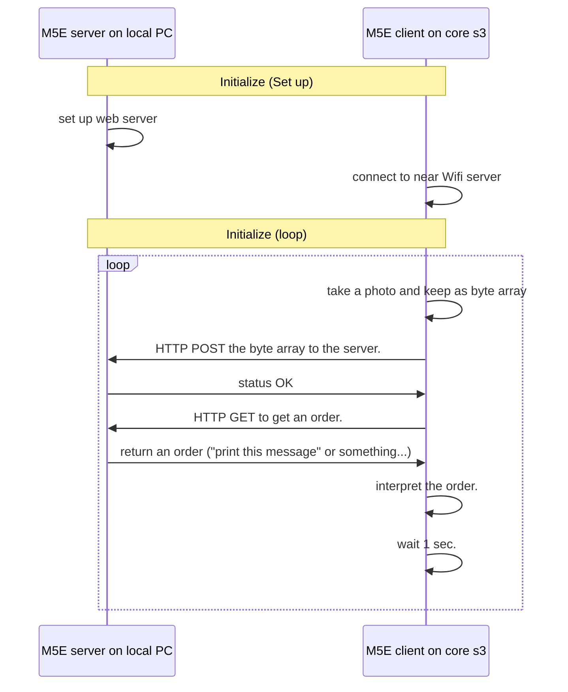

# M5stack Experiments

## システム構成

M5E server

* Node.js
* runs on local PC

M5E client

* UIFlow 2.0 (MicroPython)
* runs on m5stack core s3

```mermaid
sequenceDiagram
    participant s as M5E server on local PC
    participant c as M5E client on core s3
    Note over s,c: Initialize (Set up)
    s ->> s: set up web server
    c ->> c: connect to near Wifi server
    Note over s,c: Initialize (loop)
    loop
      c ->> c: take a photo and keep as byte array
      c ->> s: HTTP POST the byte array to the server.
      s ->> c: status OK
      c ->> s: HTTP GET to get an order.
      s ->> c: return an order ("print this message" or something...)
      c ->> c: interpret the order.
      c ->> c: wait 1 sec.
    end
```